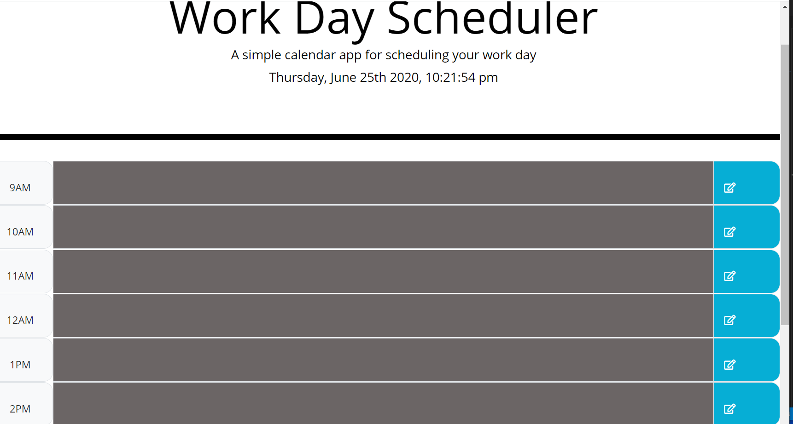

# work-dayscheduler

In this project, we made a daily planner which helps in making plans for the selected time slot and save it by pressing the button, which we can refer it later on whenever we go through the planner. We used  Bootstrap CSS Framework as well as our own and. We used  Moment.js library to work with date and time. 
 

## Getting Started

### Prerequisites
1. Bootstrap Framework.(https://stackpath.bootstrapcdn.com/bootstrap/4.5.0/css/bootstrap.min.css)

2. [Moment.js](https://momentjs.com/)

3.[For the icon in the save button]"https://fonts.googleapis.com/css?family=Open+Sans&display=swap"

2. *HTML*

3. *CSS*

4. *JavaScript*

5. *JQuery*

##  Details of Project

In this project we can save the plan and when we refresh it the plans will stil be visible. we are able to edit in the future timeslot and not in the past time slot. Different timeslot is depicted by different color. I use the localstorage to save the content edited by the user. 

My Schedular Website Link ->  (https://preeti1234567.github.io/work-dayschedular/)

