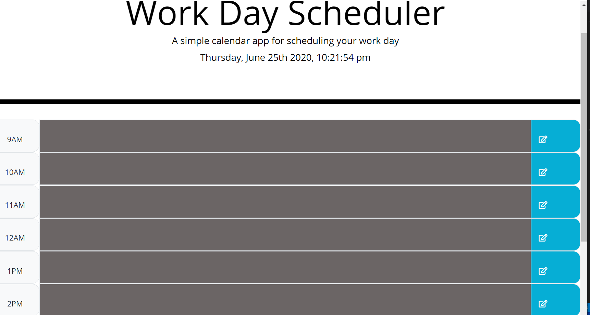

# work-dayscheduler

In this project, we made a daily planner which helps in making plans for the selected time slot and save it by pressing the button, which we can refer it later on whenever we go through the planner. We used  Bootstrap CSS Framework as well as our own and. We used  Moment.js library to work with date and time. 
 

## Getting Started

### Prerequisites
1. Bootstrap Framework.(https://stackpath.bootstrapcdn.com/bootstrap/4.5.0/css/bootstrap.min.css)

2. [For date using Moment.js library](https://momentjs.com/)

3. [For save button icon]"https://fonts.googleapis.com/css?family=Open+Sans&display=swap"

2. *HTML*

3. *CSS*

4. *JavaScript*

5. *JQuery*

##  Details of Project

In this project we can save the plan for the day and when we refresh it the plans will stil be visible. We are able to edit in the future timeslot and not in the current or past time slot. Different timeslot with respect to time is depicted by different color.( Grey means past, red means current and green means future time). Using the localstorage to save the content edited by the user so that if can be visble when he refresh the page or visit again in the day.

My Schedular Website Link ->  (https://preeti1234567.github.io/work-dayscheduler/)

